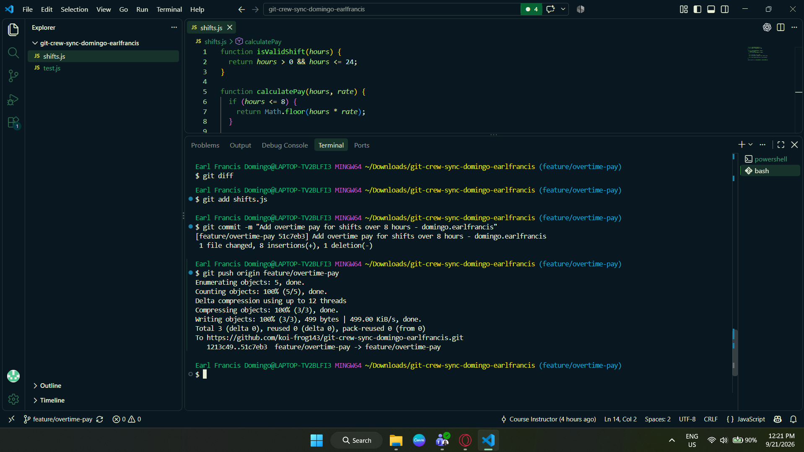
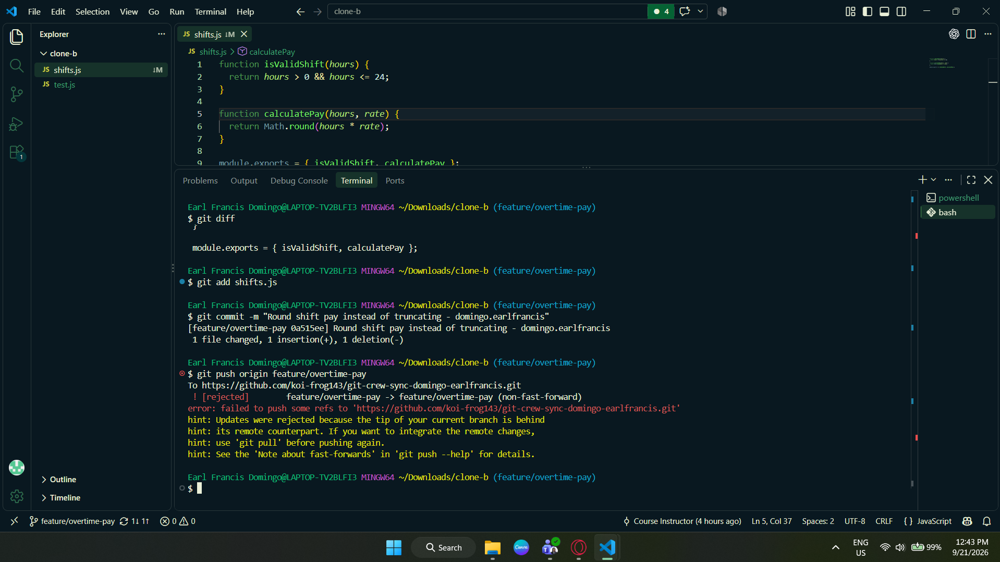
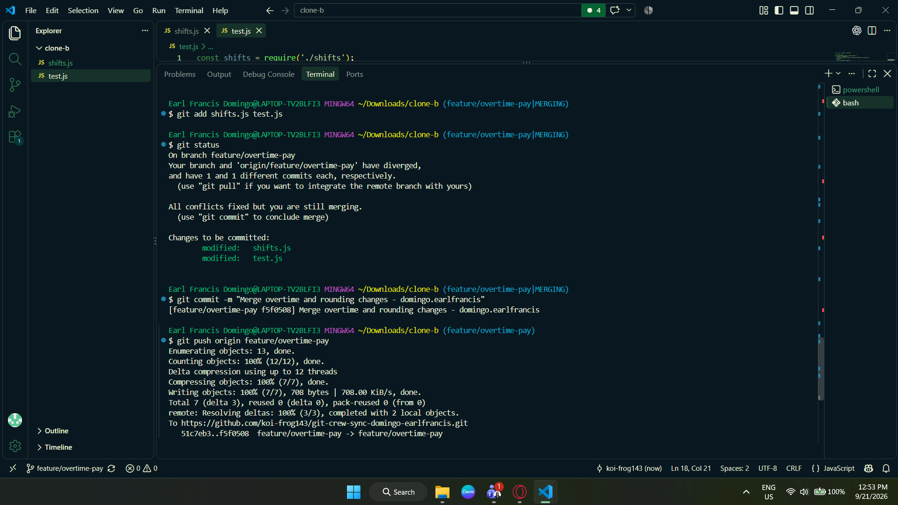
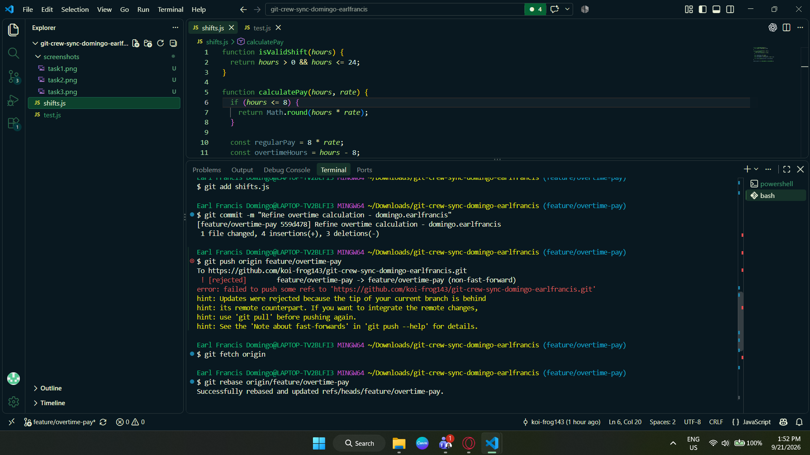
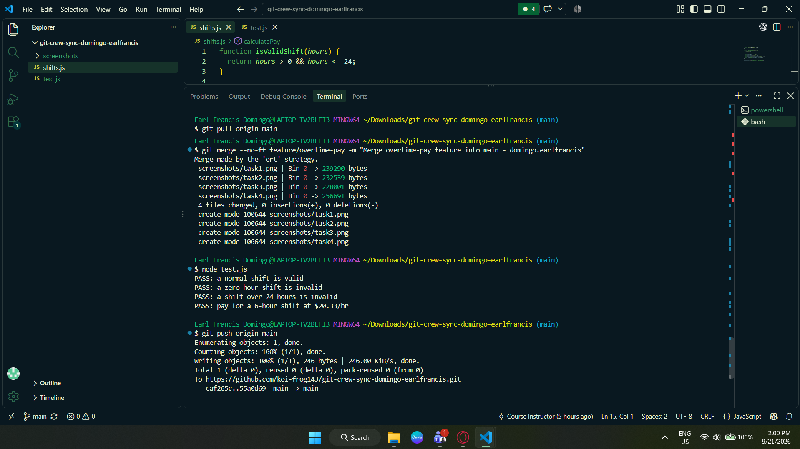

# Git Crew Sync Workflow

**Repository:** git-crew-sync-domingo-earlfrancis  
**Author:** Earl Francis Domingo

---

## Task 1 — Push a Change from Clone A

In Clone A, I checked out the `feature/overtime-pay` branch and modified `calculatePay()` to support overtime pay for shifts longer than 8 hours. The first 8 hours use the regular rate, while hours beyond 8 are paid at 1.5 times the regular hourly rate.

I ran the tests, committed the change, and successfully pushed the feature branch to GitHub.

---

## Task 2 — Diverge from Clone B and Get Rejected

In Clone B, I checked out `feature/overtime-pay` without first fetching Clone A's new commit. I made a different change to the same `calculatePay()` function by changing the calculation from `Math.floor()` to `Math.round()`.

After committing the change, I attempted to push it. Git rejected the push because the remote branch contained a commit that Clone B did not have locally.

The rejected push showed that the local branch was behind the remote branch and that the remote contained work that needed to be integrated before pushing.

---

## Task 3 — Reconcile with a Merge

In Clone B, I first fetched the latest changes from the remote using `git fetch origin`. I then merged `origin/feature/overtime-pay` into my local feature branch.

Because both Clone A and Clone B had modified the same `calculatePay()` function, Git produced a merge conflict.

I manually resolved the conflict so that both behaviors were preserved:

- overtime pay for hours over 8 at 1.5 times the regular rate
- rounding of the final calculated pay using `Math.round()`

I then ran the tests, confirmed that they passed, created the merge commit, and pushed the resolved feature branch.

---

## Task 4 — Reconcile with a Rebase

For Task 4, I worked in Clone A and made another change to `calculatePay()` without first fetching the latest remote changes.

I committed the change and attempted to push it. The push was rejected because the remote branch had changes that were not yet in my local branch.

Instead of merging, I used the required rebase workflow:

1. `git fetch origin`
2. `git rebase origin/feature/overtime-pay`
3. Resolve the rebase conflict
4. Stage the resolved changes
5. `git rebase --continue`
6. Run the tests
7. Push the rebased branch without force

The important difference from Task 3 was that the changes were replayed onto the updated remote history rather than creating another merge commit.

---

## Task 5 — Merge into Main

After completing the feature branch, I switched to `main` in Clone A and merged the finished `feature/overtime-pay` branch into `main`.

I ran the tests again and pushed the updated `main` branch to GitHub.

---

## Task 6 — Tag the Final Commit

After updating `main`, I created the final tag:

`v1.0-synced`

I pushed the tag to the GitHub repository using `git push --tags`.

The tag points to the final commit of the completed workflow.

---

# Reflection

## 1. What did the rejected push error message tell you, and why did it happen?

The rejected push message indicated that the local branch was behind its remote counterpart and that the remote contained commits that were not present locally.

This happened because another clone had pushed changes to the same remote branch before my local clone had integrated those changes. Git rejected the push because simply pushing my local history would not be a fast-forward update to the remote branch.

---

## 2. What's the actual difference between how you resolved Task 3 (merge) vs Task 4 (rebase)?

In Task 3, I used a merge. Git combined the two lines of development and created a merge commit after I manually resolved the conflict.

In Task 4, I used a rebase. Instead of creating another merge commit, Git reapplied my local commit on top of the updated remote branch. I resolved the conflict during the rebase and continued it with `git rebase --continue`.

The main difference was the resulting history: the merge preserved the divergent history with a merge point, while the rebase replayed the local work onto the updated branch history.

---

## 3. What one habit would have avoided both rejected pushes in this lab?

A useful habit would be to update my local view of the remote branch before starting new work or pushing, such as fetching the latest remote changes before making a new commit.

This would make me aware of changes that other teammates had already pushed and reduce the chance of my local branch becoming behind the remote.

---

## 4. Which approach — merge or rebase — would you default to on a shared team branch, and why?

I would generally use merge when integrating completed work on a shared team branch because it preserves the actual branching and integration history and does not require rewriting commits that other teammates may already have.

For my own local feature work, I would consider rebase useful for updating my branch with the latest shared changes before integration, provided that the branch history has not already been shared in a way that makes rewriting it problematic.